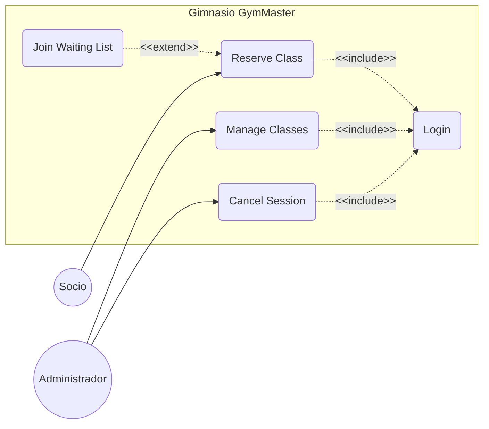
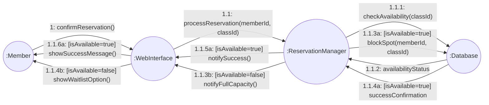
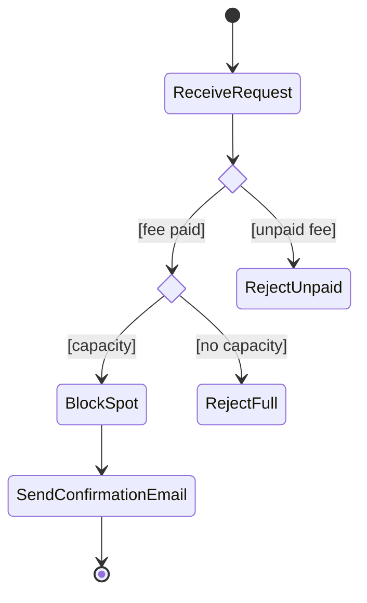
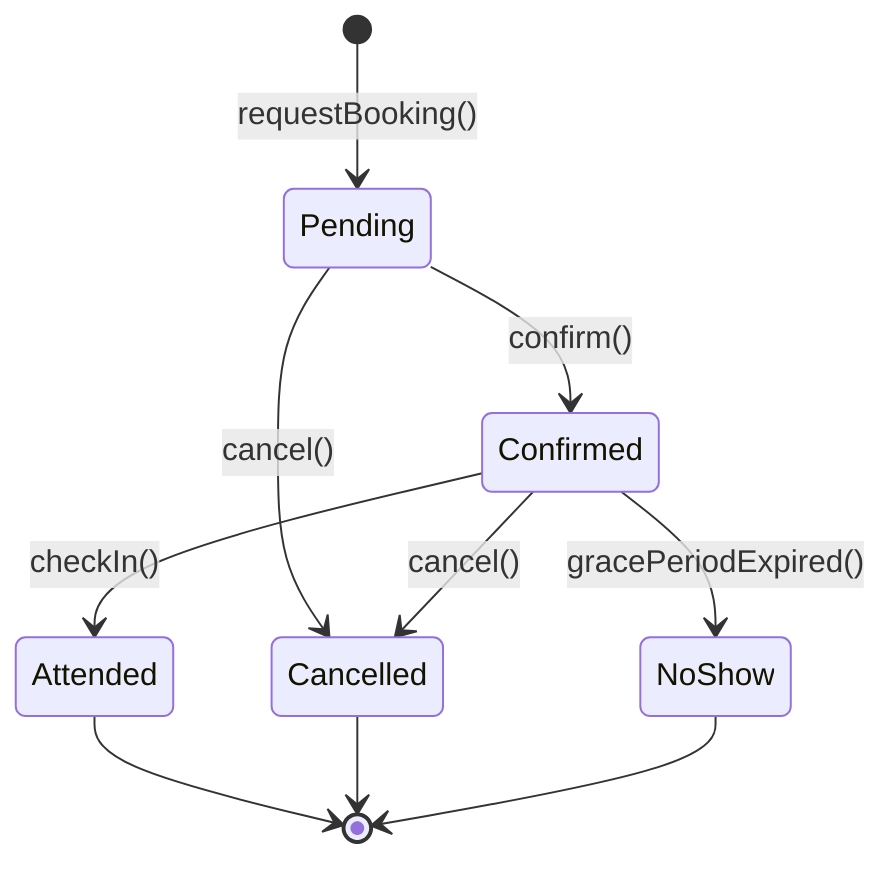

# # Documentación Técnica: Módulo de Gestión de Clases Colectivas - GymMaster

Este documento contiene el análisis y diseño técnico del sistema de gestión de reservas para el gimnasio **GymMaster**.

---

## Fase 1: Análisis de Requisitos

### Tarea 1: Diagrama de Casos de Uso

El siguiente diagrama describe las interacciones entre los actores y el sistema.

- **Actores**: `Member` (Socio) y `Admin` (Administrador).
- **Incluye**: Se requiere el `Login` para realizar cualquier acción crítica.
- **Extiende**: La opción de `Join Waiting List` aparece solo si la clase está llena.



## Fase 2: Diseño de la Interacción

### Tarea 2: Diagrama de Secuencia "Confirmar Reserva"

Representa el flujo temporal desde que el Socio pulsa el botón de confirmar.
 ```mermaid
sequenceDiagram
    autonumber
   
    %% Definición de participantes y actores
    actor S as Socio
    participant IW as InterfazWeb
    participant GM as BookingManager
    participant DB as Database

    %% Flujo de mensajes
    S->>IW: confirmarReserva()
    activate S
    activate IW
    Note right of S: El socio pulsa confirmar
    
    IW->>GM: confirmBooking(memberId, classId)
    activate GM
    
    GM->>DB: checkAvailability(classId)
    activate DB
    DB-->>GM: availabilityStatus
    deactivate DB
    Note right of DB: Respuesta de disponibilidad

    alt Hay plazas (Is Available)
        GM->>DB: createBooking(memberId, classId)
        activate DB
        DB-->>GM: success
        deactivate DB
        
        GM-->>IW: bookingConfirmed
        IW-->>S: Mostrar éxito
    else Clase llena (Is Full)
        GM-->>IW: bookingFailed(Full)
        IW-->>S: Mostrar error / Lista espera
    end

    deactivate GM
    deactivate IW
    deactivate S
```

### Tarea 3: Diagrama de Comunicación

Este diagrama muestra la misma interacción pero enfocada en las relaciones de los objetos y el orden de los mensajes.



---


## Fase 3: Lógica del Proceso

### Tarea 4: Diagrama de Actividades "Validación de Reserva"

Muestra el flujo lógico interno antes de consolidar la reserva.
* **Pasos:** 1. Recibir solicitud -> 2. ¿Socio tiene cuota pagada? (Decisión) -> 3. ¿Hay aforo? (Decisión) -> 4. Bloquear plaza -> 5. Enviar email de confirmación.
* Usa correctamente los símbolos de inicio, fin, acciones y rombos de decisión.
* 


---

## Fase 4: Ciclo de Vida del Objeto

### Tarea 5: Diagrama de Estados del Objeto "Reserva" (Booking)

Define los estados por los que pasa una reserva y los eventos que disparan la transición.



