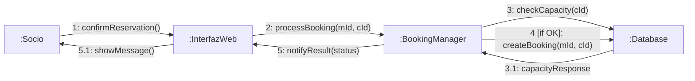

# # Documentación Técnica: Módulo de Gestión de Clases Colectivas - GymMaster

Este documento contiene el análisis y diseño técnico del sistema de gestión de reservas para el gimnasio **GymMaster**.

---

## Fase 1: Análisis de Requisitos

### Tarea 1: Diagrama de Casos de Uso

El siguiente diagrama describe las interacciones entre los actores y el sistema.

- **Actores**: `Member` (Socio) y `Admin` (Administrador).
- **Incluye**: Se requiere el `Login` para realizar cualquier acción crítica.
- **Extiende**: La opción de `Join Waiting List` aparece solo si la clase está llena.

```mermaid

graph LR
    subgraph SystemBoundary [Gimnasio GymMaster]
        UC_Login(Login)
        UC_Reserve(Reserve Class)
        UC_Waitlist(Join Waiting List)
        UC_ManageClasses(Manage Classes)
        UC_CancelSession(Cancel Session)

        UC_Reserve -.-> |"<<include>>"| UC_Login
        UC_Waitlist -.-> |"<<extend>>"| UC_Reserve
        UC_ManageClasses -.-> |"<<include>>"| UC_Login
        UC_CancelSession -.-> |"<<include>>"| UC_Login
    end

    ActorMember((Socio))
    ActorAdmin((Administrador))

    ActorMember --> UC_Reserve
    ActorAdmin --> UC_ManageClasses
    ActorAdmin --> UC_CancelSession
```Entorno-7.5

## Fase 2: Diseño de la Interacción

### Tarea 2: Diagrama de Secuencia "Confirmar Reserva"

Representa el flujo temporal desde que el Socio pulsa el botón de confirmar.

```mermaid
sequenceDiagram
    participant S as :Socio
    participant IW as :InterfazWeb
    participant GM as :BookingManager
    participant DB as :Database

    S->>IW: confirmarReserva()
    IW->>GM: confirmBooking(memberId, classId)
    GM->>DB: checkAvailability(classId)
    DB-->>GM: availabilityStatus

    alt Is Available
        GM->>DB: createBooking(memberId, classId)
        DB-->>GM: success
        GM-->>IW: bookingConfirmed
        IW-->>S: Mostrar mensaje de éxito
    else Is Full
        GM-->>IW: bookingFailed(Full)
        IW-->>S: Mostrar mensaje de clase llena/Lista de espera
    end
```

### Tarea 3: Diagrama de Comunicación

Este diagrama muestra la misma interacción pero enfocada en las relaciones de los objetos y el orden de los mensajes.

