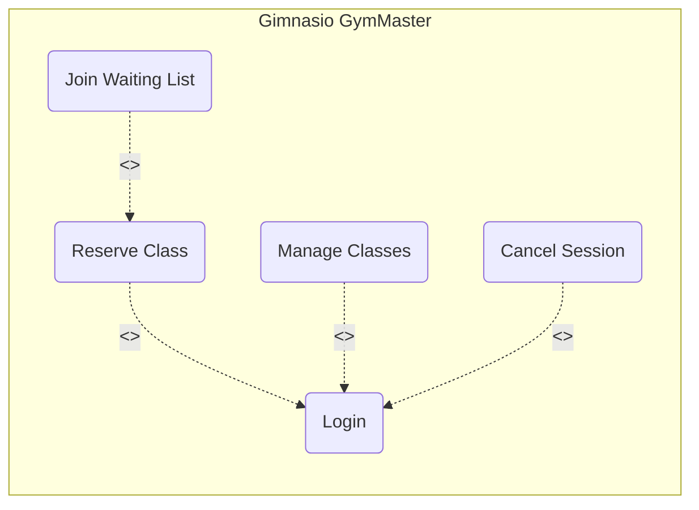
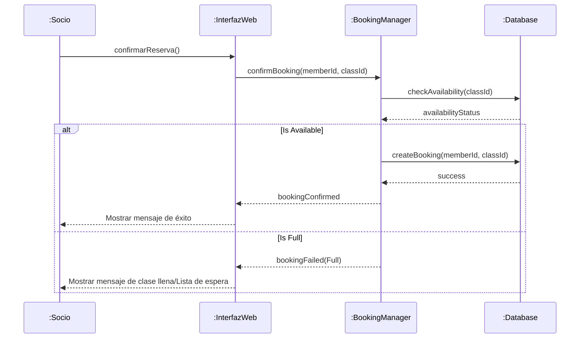
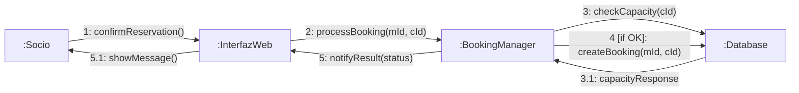
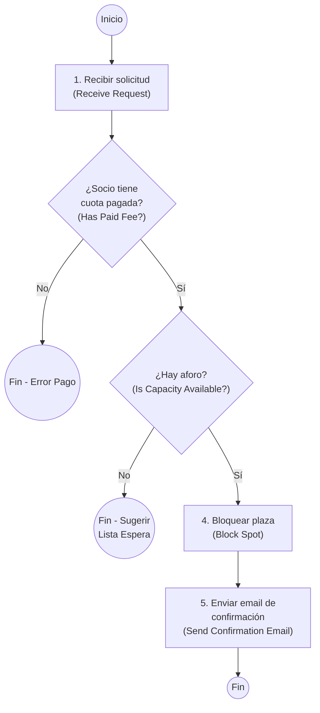
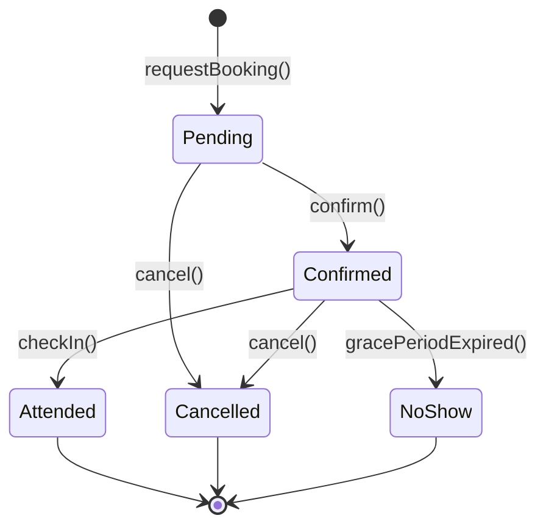

# # Documentación Técnica: Módulo de Gestión de Clases Colectivas - GymMaster

Este documento contiene el análisis y diseño técnico del sistema de gestión de reservas para el gimnasio **GymMaster**.

---

## Fase 1: Análisis de Requisitos

### Tarea 1: Diagrama de Casos de Uso

El siguiente diagrama describe las interacciones entre los actores y el sistema.

- **Actores**: `Member` (Socio) y `Admin` (Administrador).
- **Incluye**: Se requiere el `Login` para realizar cualquier acción crítica.
- **Extiende**: La opción de `Join Waiting List` aparece solo si la clase está llena.


    ActorMember((Socio))
    ActorAdmin((Administrador))

    ActorMember --> UC_Reserve
    ActorAdmin --> UC_ManageClasses
    ActorAdmin --> UC_CancelSession
```

## Fase 2: Diseño de la Interacción

### Tarea 2: Diagrama de Secuencia "Confirmar Reserva"

Representa el flujo temporal desde que el Socio pulsa el botón de confirmar.



### Tarea 3: Diagrama de Comunicación

Este diagrama muestra la misma interacción pero enfocada en las relaciones de los objetos y el orden de los mensajes.



## Fase 3: Lógica del Proceso

### Tarea 4: Diagrama de Actividades "Validación de Reserva"

Muestra el flujo lógico interno antes de consolidar la reserva.



## Fase 4: Ciclo de Vida del Objeto

### Tarea 5: Diagrama de Estados del Objeto "Reserva" (Booking)

Define los estados por los que pasa una reserva y los eventos que disparan la transición.


